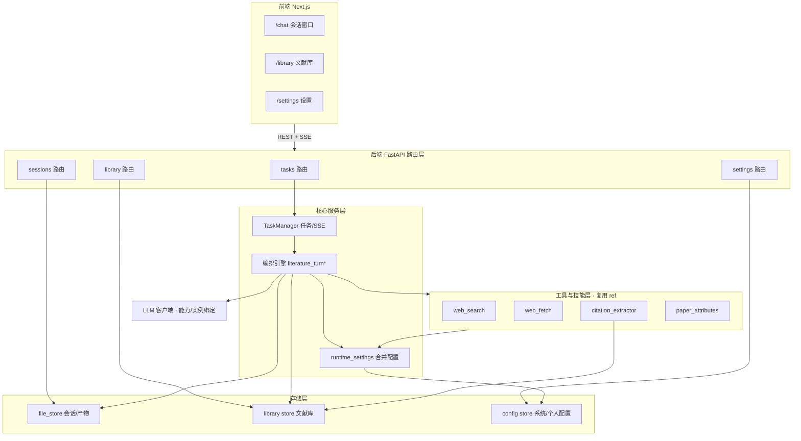
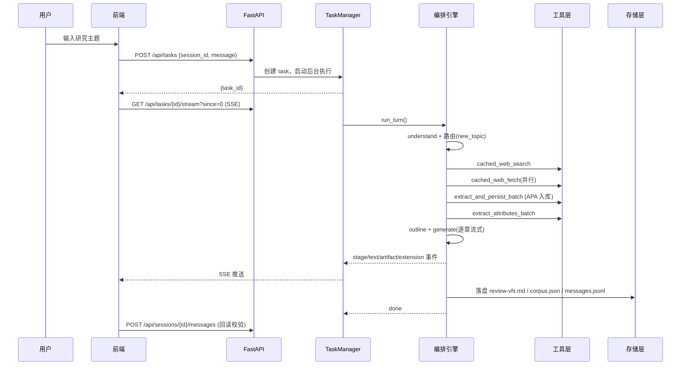

# 01 · 总体架构设计

> 本文定义 LitPilot 精简版的分层架构、模块边界、目录结构、技术选型，以及"复用 ref / 必须自写"的边界。所有后续详设文档（05–09）在本文框架内展开。

---

## 1. 分层架构



## 2. 模块边界与职责

| 层 | 模块 | 职责 | 复用/自写 |
|----|------|------|-----------|
| 路由 | `app/api/*` | HTTP 端点、请求校验、统一响应包装 | 自写 |
| 核心 | `app/tasks/*` | Task 生命周期、SSE 推流、断点续传、看门狗 | 自写 |
| 核心 | `app/agents/literature_turn*.py` | 意图路由、流水线编排、生成、收尾 | 自写 |
| 核心 | `app/agents/runtime_settings.py` | 合并系统+个人+env 配置为运行时扁平 dict | 自写 |
| 工具 | `app/agents/tools/*` | web_search/web_fetch + providers + 缓存 + 过滤 | **复用 ref** |
| 技能 | `app/skills/*` | citation_extractor、citation_meta、paper_attributes | **复用 ref** |
| 配置 | `app/agents/agent_settings.py` | 工具所需的 `get_*` 配置 getter | 自写（接口对齐 ref） |
| 配置 | `app/agents/prompt_registry.py` / `prompt_settings.py` | 默认提示词常量 + 运行期覆盖读取 | 自写 |
| 缓存 | `app/agents/ttl_cache.py` | TTL 缓存 `search_cache`/`fetch_cache` + `normalize_cache_key` | 自写 |
| LLM | `app/llm/*` | `LLMMessage`、`LLMClient.chat()`/`stream()`、多 provider 适配 | 自写 |
| 存储 | `app/storage/file_store.py` | 会话目录、产物落盘、ref-list、`get_store` | 自写 |
| 文献库 | `app/library/*` | `store`、`upsert_citation`、`canonical`、`metadata_enrich`、`from_run` | 自写 |
| 配置存储 | `app/config/*` | 系统配置/个人偏好 JSON 原子读写 + 掩码 | 自写 |
| schema | `app/schemas/*` | `paper_record`、`corpus_paper`、`literature_outline` 等 | **复用 ref** |

## 3. 关键复用接口（ref 已提供，开发期不得改签名）

| 函数 | 文件 | 签名要点 |
|------|------|----------|
| `web_search_query` | `tools/web_providers.py` | `(query, *, provider, api_key, max_results, search_depth, include_domains, exclude_domains) -> dict` |
| `web_fetch_url` / `_with_meta` | `tools/web_providers.py` | `(url, *, provider, api_key, timeout, pdf_extract_backend, s2_api_key)` |
| `cached_web_search` | `tools/cached_tools.py` | `(api_key, query, *, provider, max_results, ...)`，注意 **首参是 api_key** |
| `cached_web_fetch` | `tools/cached_tools.py` | `(url, *, provider, api_key, timeout, pdf_extract_backend)` |
| `extract_and_persist_batch` | `skills/citation_extractor.py` | `(hits, *, fetch_api_key, timeout, max_items, citation_format="apa", session_id, session_title) -> list[CitationRecord]` |
| `extract_attributes_batch` | `skills/paper_attributes.py` | `(llm, jobs, *, parallel) -> list[PaperRecord]` |
| `build_extraction_jobs` | `skills/paper_attributes.py` | `(*, fetch_results, cite_records, paper_index) -> list[PaperExtractionJob]` |

## 4. 自写层必须满足的被依赖接口（由 ref 代码反推）

ref 代码 `import` 了以下尚不存在的模块，**自写时必须提供同名符号**（详见 05/06）：

| 模块 | 必须导出 |
|------|----------|
| `app/agents/agent_settings.py` | `get_pdf_extract_backend`、`get_s2_api_key`、`get_jina_reader_api_key`、`get_web_search_provider`、`get_web_fetch_provider`、`get_fetch_parallel`（均 `async`） |
| `app/agents/ttl_cache.py` | `search_cache`、`fetch_cache`（含 `.get/.set`）、`normalize_cache_key(provider, key, extra)` |
| `app/agents/prompt_registry.py` | `DEFAULT_ATTRIBUTE_SYSTEM` 等默认提示词常量 |
| `app/agents/prompt_settings.py` | `get_attribute_system_prompt()`、`get_prompt_max_tokens(key)`（均 `async`） |
| `app/llm/base.py` | `LLMMessage(role, content)`、`LLMResponse(content, ...)`、`LLMClient.chat(messages, *, system, max_tokens, temperature)` |
| `app/storage/file_store.py` | `get_store()` → 含 `read_ref_list()` 的 store |
| `app/library/canonical.py` | `canonical_key(*, url=None, doi=None)`、`normalize_url(url)` |
| `app/library/store.py` | `LibraryStore`（读写 `refs/library.json`） |
| `app/library/upsert_citation.py` | `upsert_from_citation(rec, *, lib=None, citation_format, session_id, session_title, enrich_patch=None) -> dict|None` |
| `app/library/from_run.py` | `_sync_exports(lib)` |
| `app/library/metadata_enrich.py` | `enrich_records_parallel(records, *, parallel) -> list[dict]` |

## 5. 后端目录结构

```
backend/
├── app/
│   ├── main.py                      # FastAPI 入口、CORS、路由挂载
│   ├── api/
│   │   ├── __init__.py
│   │   ├── tasks.py                 # /api/tasks*
│   │   ├── sessions.py              # /api/sessions*
│   │   ├── library.py               # /library*
│   │   └── settings.py              # /api/settings*
│   ├── tasks/
│   │   ├── manager.py               # TaskManager（内存任务表 + 事件缓冲）
│   │   └── sse.py                   # Meso 信封序列化、SSE 生成器
│   ├── agents/
│   │   ├── agent_settings.py        # get_* 配置 getter（自写）
│   │   ├── runtime_settings.py      # 配置合并
│   │   ├── prompt_registry.py       # 默认提示词
│   │   ├── prompt_settings.py       # 运行期提示词读取
│   │   ├── ttl_cache.py             # TTL 缓存
│   │   ├── literature_turn.py       # setup/意图/理解路由/委托
│   │   ├── literature_turn_pipeline.py  # 检索→抓取→引用→结构化→大纲
│   │   ├── literature_turn_generate.py  # 问答/矩阵/综述生成交付
│   │   ├── literature_turn_finalize.py  # 语料/meta/库/消息收尾
│   │   ├── literature_router.py     # 续聊意图路由
│   │   ├── literature_clarification.py  # 澄清门
│   │   ├── content_pipeline.py      # 材料压缩
│   │   └── tools/                   # ← 复用 ref（providers、cached_tools、search_hits 等）
│   ├── skills/                      # ← 复用 ref（citation_extractor、citation_meta、paper_attributes）
│   ├── schemas/                     # ← 复用 ref（paper_record、corpus_paper、literature_outline）+ 自写 session/task
│   ├── llm/
│   │   ├── base.py                  # LLMMessage/LLMResponse/LLMClient 抽象
│   │   ├── openai_compat.py         # OpenAI 兼容 provider
│   │   └── factory.py               # 按能力/实例构建客户端
│   ├── storage/
│   │   └── file_store.py            # 会话/产物文件存储
│   ├── library/
│   │   ├── store.py
│   │   ├── canonical.py
│   │   ├── upsert_citation.py
│   │   ├── metadata_enrich.py
│   │   └── from_run.py
│   └── config/
│       ├── paths.py                 # 数据/配置目录解析（env 可覆盖）
│       ├── system_config.py         # system.*.json 读写 + 掩码
│       └── personal_config.py       # personal.preferences.json
├── tests/                           # pytest（test_*.py）
├── data/                            # 运行期数据（gitignore）
├── config/                          # 运行期配置 json（gitignore 敏感项）
├── requirements.txt
├── pyproject.toml / setup.cfg       # flake8、pytest 配置
└── Dockerfile
```

## 6. 前端目录结构（详见 09）

```
frontend/
├── app/                     # Next.js App Router
│   ├── layout.tsx           # 根布局 + ToastProvider
│   ├── page.tsx             # 重定向到 /chat
│   ├── chat/
│   │   ├── page.tsx         # 主聊天页（使用 ChatShell）
│   │   └── [sessionId]/page.tsx  # 动态路由聊天页
│   ├── library/page.tsx     # 文献库
│   └── settings/            # 设置（layout + personal + admin/*）
├── components/
│   ├── ToastProvider.tsx    # 全局 Toast 通知
│   ├── NavSidebar.tsx       # 导航侧栏
│   ├── LitPilotMark.tsx     # 品牌 Logo
│   ├── chat/ (ChatShell, SessionList, MessageArea, WorkflowCard, TurnCompletionBar, Composer)
│   ├── artifact/ (ArtifactPanel)
│   └── (library/settings 内联在各 page 中)
├── lib/
│   ├── api.ts               # REST 客户端
│   ├── sse.ts               # SSE 解析 + 流状态机
│   └── types.ts             # TypeScript 类型定义
├── styles/
│   └── tokens.css           # brand tokens
└── package.json
```

## 7. 技术选型

| 关注点 | 选型 | 理由 |
|--------|------|------|
| Python 版本 | 3.14 | 系统可用 `/opt/homebrew/bin/python3.14` |
| ASGI | uvicorn | 标准 |
| HTTP 客户端 | httpx | ref 工具依赖 |
| PDF | pymupdf4llm（默认）/ pypdf（兜底） | ref 约定；商用注意 Artifex 许可 |
| 文件锁 | filelock | 并发安全 |
| 测试 | pytest + pytest-asyncio + respx | 异步 + HTTP mock |
| Lint | flake8 | 用户规则要求 |
| 前端 | Next.js 16.2.9 LTS（App Router）+ TypeScript + React 19 | FRS 参考实现升级 |
| 前端样式 | Tailwind CSS + brand tokens（CSS 变量） | 接入 `docs/brand` |

## 8. 数据流（一次 new_topic 综述）



## 9. 错误与降级策略（架构级）

- web_search 全失败 → 终止当轮，提示检查凭据/换 query（澄清门 `search_zero`）。
- 单 URL web_fetch 失败 → 跳过，回退检索 snippet，不阻断整轮。
- 引用元数据不足 → 不写半条，正文标注「待核实」。
- LLM 不可用 → 规则兜底（路由落 `query_corpus`；属性抽取走 `rule_based_attri`）。
- SSE 上游冻结 120s → 看门狗 abort，置错误态可重试。
