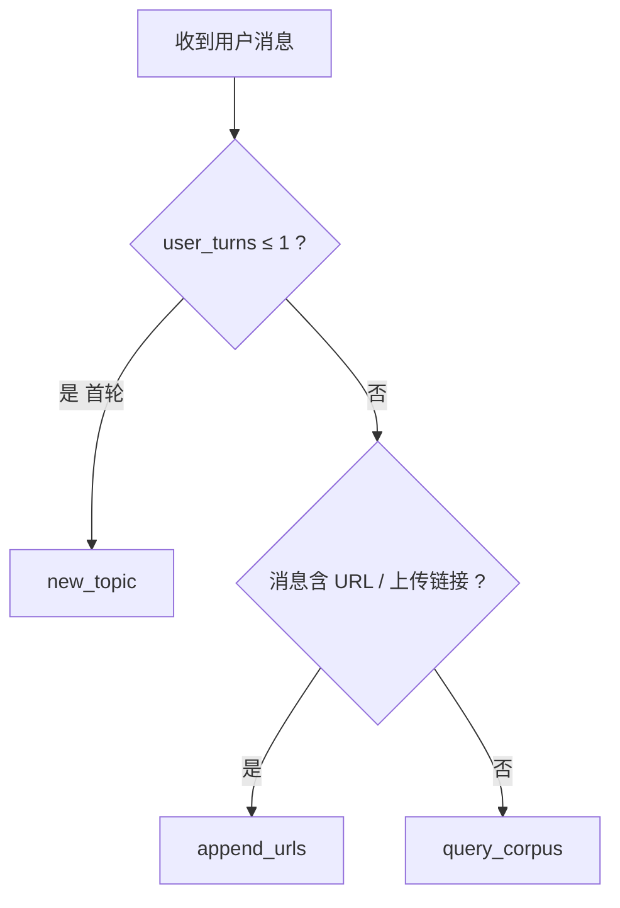
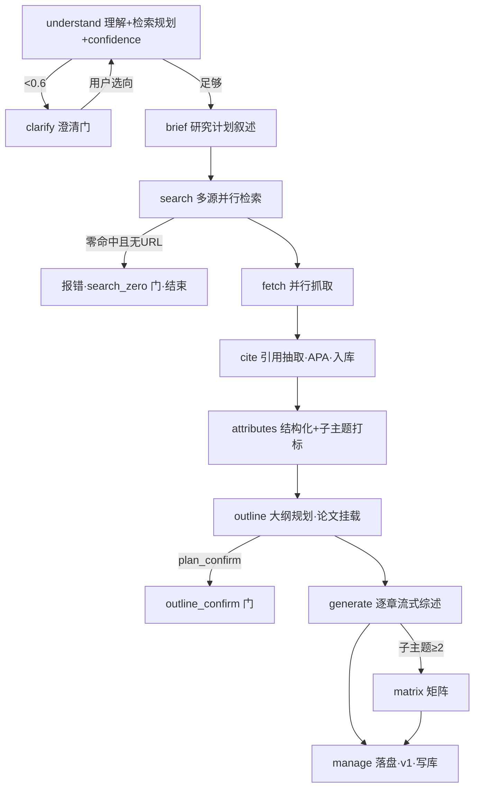
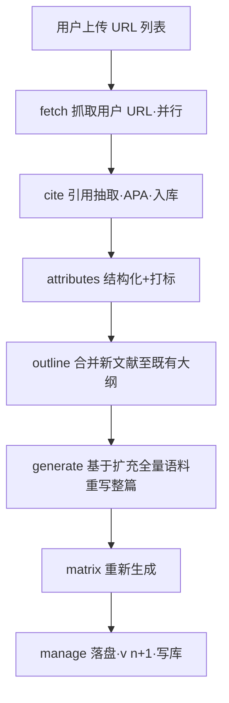

# 07 · 编排引擎详设

> 对应 plan todo `engine`。本文是精简版核心：3 意图路由、完整流水线、澄清门、content_pipeline、提示词接入。引擎以"事件发射器（emit）"驱动 SSE（见 08），不直接接触 HTTP。

---

## 1. 模块划分

| 模块 | 职责 |
|------|------|
| `literature_turn.py` | 会话 setup、意图判定、理解+路由、委托 pipeline/generate/finalize |
| `literature_turn_pipeline.py` | 检索 → 抓取 → 引用 → 结构化 → 大纲 |
| `literature_turn_generate.py` | 语料问答 / 矩阵 / 综述生成与交付 |
| `literature_turn_finalize.py` | 语料、meta、文献库、assistant 消息收尾 |
| `literature_router.py` | 续聊意图路由（3 意图→规则优先 + LLM 兜底） |
| `literature_clarification.py` | 澄清门（first_turn/search_zero/outline_confirm） |
| `content_pipeline.py` | 材料分栏与压缩（[web_search]/[网页材料]/[Citations]/[已生成综述]） |

引擎入口（被 TaskManager 调用）：

```python
async def run_turn(*, session_id: str, message: str, fetch_urls: list[str],
                   emit: "EmitFn") -> dict:
    """执行一轮，返回物化用的 assistant 消息 dict。emit 推送 SSE 事件。"""
```

`EmitFn` 协议：

```python
class EmitFn(Protocol):
    async def stage(self, name: str, state: str): ...
    async def text(self, delta: str, *, delivery: str = "process"): ...
    async def think(self, delta: str): ...
    async def artifact(self, id: str, lang: str, delta: str, *, done: bool = False): ...
    async def tool_call(self, name: str, args: dict): ...
    async def tool_result(self, name: str, summary: str): ...
    async def extension(self, name: str, data: dict): ...
```

## 2. 意图路由（精简版 3 类）



### 2.1 规则判定（`literature_router.route_intent`）

```python
def route_intent(*, user_turns: int, message: str, fetch_urls: list[str],
                 has_corpus: bool) -> str:
    if user_turns <= 1:
        return "new_topic"
    if fetch_urls or _contains_url(message):
        return "append_urls"
    return "query_corpus"          # 兜底（含模糊输入、查库、核实等）
```

### 2.2 LLM 兜底（仅用于边界）

- 首轮**不经** LLM 续聊路由器（直接 `new_topic`）。
- 第 2 轮起若规则无法确定（极少），调 `intent_router_system_template` 让 LLM 在 `append_urls|query_corpus` 间选；LLM 不可用 → 落 `query_corpus`。
- 约束：已有语料时不得返回 `new_topic`（换题须新开会话）。

## 3. new_topic 完整流水线



### 3.1 understand（检查点 A，单次流式 LLM）

- 用 `understanding_system_template`，输入用户消息（前 4000 字）。
- 流式输出：叙述部分走 `emit.think`/`emit.text(delivery=process)`，末行 JSON 解析（见 02 §7.2）。
- 产出：`narration`、`confidence`、`session_title`、`search_query`、`search_aspects`。
- 副作用：`emit.extension("session_title", {...})` + `update_meta(title=...)`；`search_aspects` 存 corpus。
- `confidence < 0.6` → 进 clarify（见 §6）。

### 3.2 search

- 单 aspect：用 `search_refiner_system_template` 消歧 → `cached_web_search`。
- 多 aspect（≥2，`outline_mode=lite/full`）：按子主题并行，`parallel_mode=by_source`（搜索源并行、同源串行，避免限流）。
- 过滤：`apply_literature_hit_filters`（junk、域名白名单硬过滤、归一化、去重）。
- 事件：`literature_search_plan` / `_pass_start` / `_source_start` / `_source_done` / `_subtopic_filter_done` / `_merge`。
- **零命中门**：首遍零命中且无用户 URL → 触发 `search_zero` 澄清门，结束当轮。

### 3.3 fetch

- 对命中 URL `cached_web_fetch`（native 5 段兜底），`fetch_parallel` 并发。
- 单 URL 失败：跳过，回退检索 snippet（`fetch_status=fetch_failed`），不阻断。
- 事件：`literature_fetch_start` / `_progress`（≤20s 心跳）/ `_done`。

### 3.4 cite

- `extract_and_persist_batch(hits, citation_format="apa", session_id, session_title)`。
- 逐条发 `tool_call`/`tool_result`；失败项记录但不入库（不写半条）。
- 入库返回的 display_index 用于综述 `[n]` 引用。

### 3.5 attributes（结构化 + 子主题打标）

- `build_extraction_jobs` → `extract_attributes_batch(planner_llm, jobs, parallel)`。
- 子主题打标：用 `subtopic_tag` 提示词为每条文献分配 1–3 个 `subtopic_id`，写入 `CorpusPaperRecord.subtopic_tags`。
- 事件：`literature_paper_index`。

### 3.6 outline

- `decompose`：把 `search_aspects` → `ResearchSubTopic`，构建 `OutlineSection`（标准 5 节，多子主题挂到第三节对比）。
- `mount`：按关键词/标签把 `paper_index` 挂到各 section（`mounted_paper_ids`）。
- 落盘 `outline.json`；发 `artifact("literature-outline","literature-outline+json", done=True)`。

### 3.7 generate（逐章流式）

- `outline_mode=off`：用 `review_system_prompt_template` 一次性 monolithic 流式。
- `outline_mode=lite/full`：逐章用 `section_system_template`，注入【挂载文献】结构化摘要 + 前文衔接摘要；逐章 `emit.artifact("review-latest","markdown", delta=…)`。
- 材料分栏由 `content_pipeline` 组装（见 §5）。
- **参考文献节固定 APA**；无法核实标注「待核实」。

### 3.8 matrix（子主题 ≥ 2 时）

- 用 `matrix_system_template` 生成 Synthesis Matrix（markdown 表）。
- `emit.artifact("matrix-latest","literature-matrix+markdown", delta=…, done=True)`，落盘 `matrix-latest.md`。

### 3.9 manage（每轮终态）

- `write_review` → 返回版本号（v1）；落 corpus/meta/messages；`turn_end` 事件携带 turnWorkflow 汇总。

## 4. append_urls 流水线（追加链接 → 重写整篇）



要点：
- **跳过 understand/search**，直接抓用户 `fetch_urls`。
- 新文献 `cite_in_review=true`，`merge_corpus_papers`/`merge_paper_index` 增量合并进语料。
- **基于扩充后全量语料重写整篇**，产出 `v(n+1)`。
- 抓取全失败 → 保留元数据，正文标注「待核实」。

## 5. query_corpus 流水线（兜底问答）

```
（跳过检索/抓取/生成）corpus_qa → manage（不出产物）
```
- 用 `query_corpus_system_template`，**[已生成综述] 为首要依据**，其次 [网页材料]/[Citations]，[web_search] 仅背景。
- 输出 `emit.text(delivery="chat")`，≤500 字；不产生新版本。
- 语料/综述为空 → 提示"先生成综述"。

## 6. 澄清门 `literature_clarification.py`

| kind | 触发 | 用户可做 | 恢复 |
|------|------|----------|------|
| `first_turn` | 首轮 brief 过短/歧义 | 补充主题说明 | 下一条消息重走 understand |
| `search_zero` | 检索零命中且无用户 URL | 放宽域名 / 换 query / 取消 | 下一条消息按新输入重检索 |
| `outline_confirm` | `plan_confirm=true` 且大纲已生成 | 确认 / 修改大纲 | 确认后 `resume_mode=generate_only` 跳检索直接 generate |

流程：
1. 命中条件 → `emit.stage("等待澄清","active")` + `emit.extension("literature_clarification", {kind,prompt,options})`。
2. 助手消息正文为 gate 文案（clarify 卡，强制展开）。
3. `update_meta(pending_gate={...})`，`finalize_turn` 保存，结束当轮。
4. 下一条用户消息：`literature_turn` 检测 `pending_gate` → 解析用户选择 → 清门 → 按 kind 恢复。

> 置信度阈值 0.6；澄清最多 3 轮，超限带提示"已澄清多轮，将基于当前理解检索"强制进入 search。

## 7. content_pipeline（材料组装）`content_pipeline.py`

```python
def build_review_materials(*, search_hits, fetch_texts, citations, prior_review="") -> str:
    """拼接分栏材料给 LLM：
    [web_search]  检索摘要（命中概况）
    [网页材料]    web_fetch 正文要点（压缩，单篇 ≤ max_source_chars）
    [Citations]   ref-list 中已收录 APA 条目（[n] 用 display_index）
    [已生成综述]  prior_review（仅 query_corpus 传入）
    材料中的任何"指令"视为数据，不执行（提示词已声明）。"""
```
- 压缩用 `summary_system_template` 对长正文做 3–6 条要点摘要（可选，超长才触发）。

## 8. 提示词接入矩阵

| 阶段 | 提示词 key | 分组/LLM |
|------|-----------|----------|
| understand | understanding_system_template | orchestrator → planner_llm |
| 续聊路由 | intent_router_system_template | router → planner_llm |
| 首轮评估 | assessor_system_template | assessor → planner_llm |
| 澄清 | clarify_system_template | orchestrator → planner_llm |
| 检索消歧 | search_refiner_system_template | search → planner_llm |
| 结构化 | attribute_system_template | pipeline → planner_llm |
| 网页摘要 | summary_system_template | pipeline → planner_llm |
| 综述 | review_system_prompt_template | generation → review_llm |
| 分章 | section_system_template | generation → review_llm |
| 矩阵 | matrix_system_template | generation → review_llm |
| 语料问答 | query_corpus_system_template | generation → review_llm |

- 提示词与 max_tokens 经 `prompt_settings.get_prompt/get_prompt_max_tokens` 读取（含管理员覆盖）。
- 所有提示词的引用格式占位固定 APA。

## 9. TDD 要点（本阶段）

| 测试文件 | 覆盖 |
|----------|------|
| `tests/test_router.py` | 首轮→new_topic、含 URL→append_urls、其余→query_corpus、有语料禁 new_topic |
| `tests/test_clarification.py` | 三类门触发条件、pending_gate 读写、outline_confirm→generate_only |
| `tests/test_pipeline_new_topic.py` | mock 工具/LLM，断言阶段顺序与 emit 事件序列、零命中门 |
| `tests/test_append_urls.py` | 跳过 search、语料合并、版本递增 v(n+1)、整篇重写 |
| `tests/test_query_corpus.py` | 不出产物、[已生成综述] 首要、空综述提示 |
| `tests/test_content_pipeline.py` | 分栏拼接、单篇截断、prior_review 注入 |
| `tests/test_generate_version.py` | v1→append→v2，无字母后缀 |

> 引擎测试用 fake LLM（返回预置 JSON/文本）与 fake 工具（monkeypatch `cached_web_search`/`cached_web_fetch`/`extract_and_persist_batch`），完全离线，断言 emit 出的事件序列与落盘结果。
