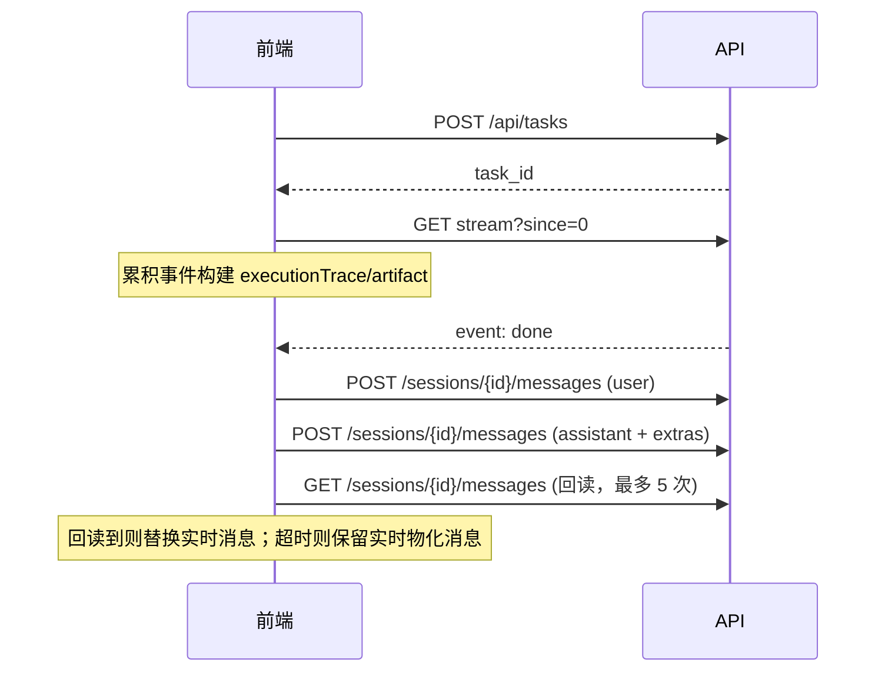

# 08 · Task 与 SSE 流式层详设

> 对应 plan todo `streaming`。本文定义任务生命周期、SSE 推流、断点续传、看门狗与落盘回读。把引擎（07）的 `emit` 事件桥接到 HTTP SSE（04 契约）。

---

## 1. 组件

| 模块 | 职责 |
|------|------|
| `app/tasks/manager.py` | `TaskManager`：内存任务表、事件缓冲、后台执行、取消 |
| `app/tasks/sse.py` | Meso 信封序列化、SSE 生成器（含续传与心跳） |
| `app/api/tasks.py` | 4 个端点（见 03 §3） |

## 2. TaskManager

```python
@dataclass
class TaskRecord:
    task_id: str
    session_id: str
    message: str
    fetch_urls: list[str]
    status: str = "pending"            # pending|running|done|error|cancelled
    events: list[dict] = field(default_factory=list)   # 带 seq 的信封
    error: str | None = None
    _seq: int = 0
    _new_event: asyncio.Event = ...    # 唤醒等待中的 SSE 消费者
    _cancel: asyncio.Event = ...

class TaskManager:
    def create(self, session_id, message, fetch_urls) -> TaskRecord
    def get(self, task_id) -> TaskRecord | None
    async def run(self, task_id) -> None       # 后台协程入口
    def cancel(self, task_id) -> bool
    async def emit(self, task_id, event_type, data) -> None   # 追加事件，分配 seq，set _new_event
```

### 2.1 启动

- `POST /api/tasks` → `tm.create(...)` → `asyncio.create_task(tm.run(task_id))` → 立即返回 `task_id`。
- `run()` 构造 `EmitFn`（其方法内部调 `tm.emit`），调 `literature_turn.run_turn(..., emit=emit)`。

### 2.2 emit → 事件缓冲

```python
async def emit(self, task_id, event_type, data):
    rec = self.get(task_id)
    rec._seq += 1
    env = {"event": event_type, "data": {**data, "seq": rec._seq}}
    rec.events.append(env)
    rec._new_event.set(); rec._new_event = asyncio.Event()
```

`EmitFn` 适配示例：

```python
class TaskEmit:
    def __init__(self, tm, task_id): ...
    async def stage(self, name, state): await self.tm.emit(self.id, "stage", {"name": name, "state": state})
    async def text(self, delta, *, delivery="process"): await self.tm.emit(self.id, "text", {"delta": delta, "delivery": delivery})
    async def artifact(self, id, lang, delta, *, done=False): await self.tm.emit(self.id, "artifact", {"id": id, "lang": lang, "delta": delta, "done": done})
    async def extension(self, name, data): await self.tm.emit(self.id, "extension", {"name": name, "version": "1.0", "data": data})
    # think/tool_call/tool_result 同理
```

### 2.3 结束与异常

- `run_turn` 正常返回 → `tm.emit(done)`，`status=done`，落盘助手消息（见 §5）。
- 抛异常 → `tm.emit(error, {message})`，`status=error`。
- 取消 → `_cancel.set()`，引擎在阶段间检查 `_cancel`，尽快停止；`status=cancelled`。

### 2.4 生命周期与清理

- 任务完成后保留事件缓冲一段时间（如 10 min）供断线续传与 `status` 查询，之后 GC。
- 进程重启任务全失效：前端通过 `GET /sessions/{id}/messages` 恢复历史（已落盘）。

## 3. SSE 生成器 `app/tasks/sse.py`

```python
async def event_stream(tm: TaskManager, task_id: str, since: int):
    rec = tm.get(task_id)
    if rec is None:
        yield _frame("error", {"message": "task not found", "seq": 0}); return
    # 1. 回放历史
    for env in rec.events:
        if env["data"]["seq"] > since:
            yield _frame(env["event"], env["data"])
            since = env["data"]["seq"]
    # 2. 已结束：回放完即收尾
    while rec.status in ("running", "pending"):
        try:
            await asyncio.wait_for(rec._new_event.wait(), timeout=15)
        except asyncio.TimeoutError:
            yield _frame("extension", {"name": "heartbeat", "version": "1.0", "data": {}, "seq": since})
            continue
        for env in rec.events:
            if env["data"]["seq"] > since:
                yield _frame(env["event"], env["data"]); since = env["data"]["seq"]
    # 3. 收尾：补发剩余 + 终止
    for env in rec.events:
        if env["data"]["seq"] > since:
            yield _frame(env["event"], env["data"]); since = env["data"]["seq"]

def _frame(event: str, data: dict) -> str:
    return f"event: {event}\ndata: {json.dumps(data, ensure_ascii=False)}\n\n"
```

FastAPI 端点：

```python
@router.get("/api/tasks/{task_id}/stream")
async def stream(task_id: str, since: int = 0):
    return StreamingResponse(
        event_stream(tm, task_id, since),
        media_type="text/event-stream",
        headers={"Cache-Control": "no-cache", "X-Accel-Buffering": "no", "Connection": "keep-alive"},
    )
```

## 4. 看门狗（前端为主，后端心跳辅助）

- **后端**：长阶段每 ≤20s 发 `literature_progress`（引擎负责）；SSE 生成器 15s 无事件发 `heartbeat`，避免连接被中间层断开。
- **前端**：收到响应头后启动 120s 计时器，每次 chunk 重置；超时 `AbortController.abort()` → 置错误态 + 重试按钮。

## 5. 落盘与回读校验（前端时序）



- 用户消息与助手消息分别落盘（助手消息 `extras` 含 executionTrace/turnWorkflow/intent/review_version）。
- `reloadSessionMessages(sessionId, {pendingUserText, maxAttempts:5})`：轮询直至出现或超时；失败回退展示实时消息。

## 6. 取消语义

- `DELETE /api/tasks/{id}` → `tm.cancel`。
- 引擎在每个阶段开始处 `if emit.cancelled(): raise TurnCancelled`。
- SSE 生成器在 `status=cancelled` 时收尾结束流。
- 前端"停止"按钮 → 调 DELETE → 清流回 idle。

## 7. TDD 要点（本阶段）

| 测试文件 | 覆盖 |
|----------|------|
| `tests/test_task_manager.py` | create/run/emit seq 递增/cancel/状态机 |
| `tests/test_sse_stream.py` | since=N 续传只补发 seq>N、done 后收尾、task 不存在 error、heartbeat |
| `tests/test_tasks_api.py` | POST 首轮带 fetch_urls 400、201 返回 task_id、status、DELETE 取消 |
| `tests/test_emit_adapter.py` | TaskEmit 各方法生成正确信封 |

> 用 fake `run_turn`（注入预置 emit 序列）驱动 TaskManager，断言 SSE 输出帧；不依赖真实引擎。
